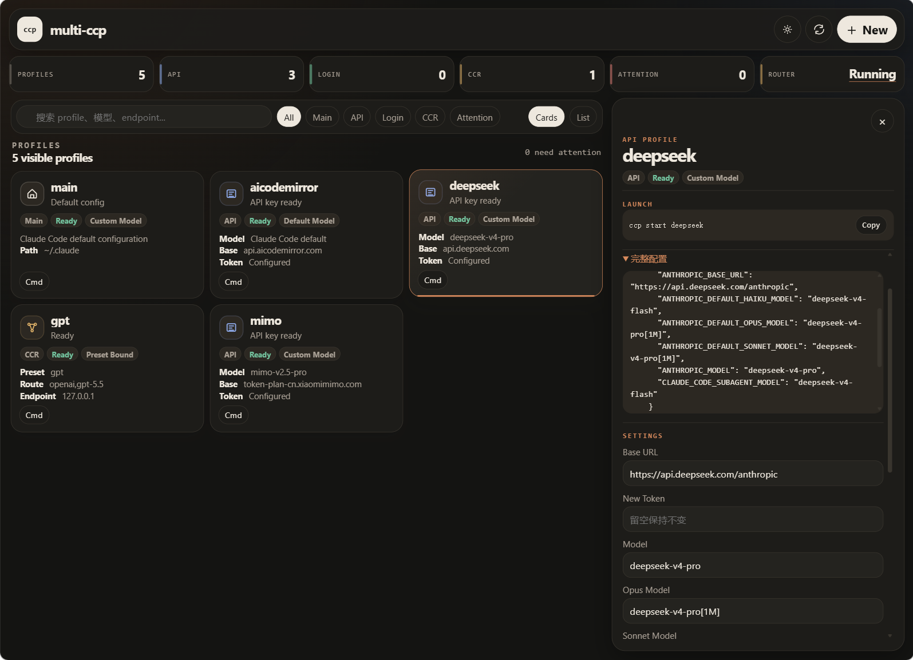
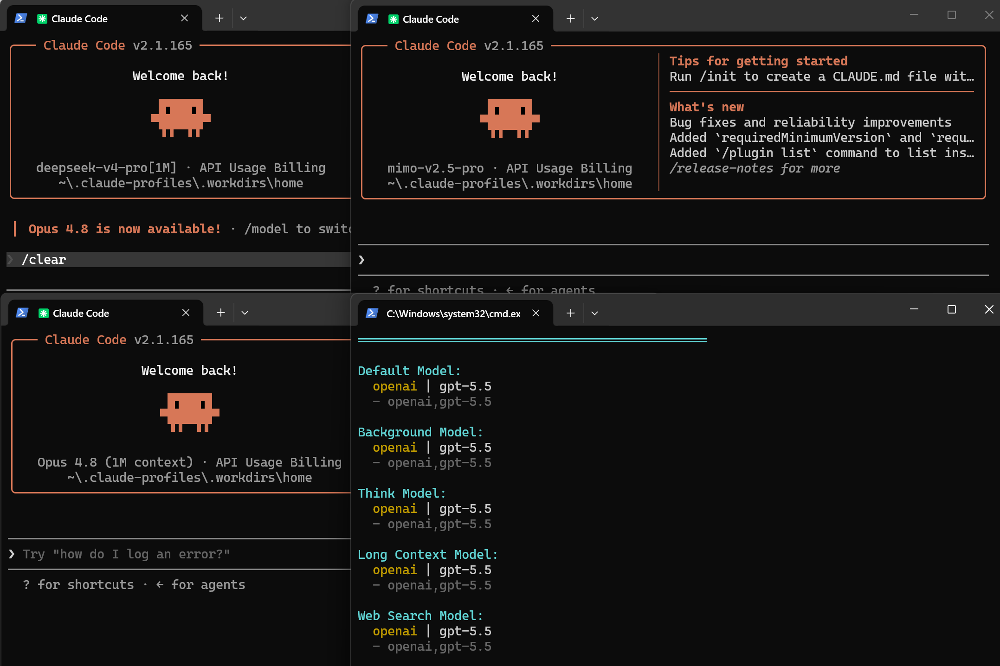

# multi-ccp

[![NPM Version][npm-version]][npm-url]
[![NPM Downloads][npm-downloads]][npm-url]
[![License][license]][license-url]

[English](README.md) | 简体中文

`multi-ccp` 是一个 Claude Code profile 和历史会话管理工具。它会安装 `ccp` 命令，帮助你运行多个 Claude Code 会话窗口，并让每个窗口拥有独立隔离的配置目录、模型 provider、登录状态和历史记录。

当你希望为工作、个人项目、不同 API provider、不同模型路由分别使用独立 Claude Code 会话时，可以使用 `multi-ccp`，无需手动切换环境变量或反复编辑配置文件。



## 功能特性

- 使用独立 profile 运行多个 Claude Code 会话窗口。
- 每个 profile 的 Claude Code 配置、登录状态、环境变量和项目历史记录互相隔离。
- 创建兼容 Anthropic API 的 profile，自定义 `ANTHROPIC_BASE_URL`、token 和模型配置。
- 创建 Claude 登录 profile，使用 Claude Code 正常账号登录流程，不保存账号密码。
- 创建 [Claude Code Router](https://github.com/musistudio/claude-code-router) preset profile，支持多个模型 provider 和 route。
- 通过同一个 CLI 管理 [Claude Code Router](https://github.com/musistudio/claude-code-router)。
- 使用内置网关让 Claude Code 连接 OpenAI 或 OpenAI-compatible Responses / Chat Completions provider。
- 多个 gateway profile 可以并发复用一个本地进程，同时按请求隔离上游 URL、模型、凭据、工具映射、流状态和取消信号。
- 在不同 profile 之间，或在 `main` 与 profile 之间同步 Claude Code 历史会话。

## 安装

```bash
npm install -g multi-ccp
```

验证安装：

```bash
ccp --version
ccp help
```

更新 `multi-ccp`：

```bash
npm install -g multi-ccp@latest
```

## 快速开始

想走最短路径？可以先问 AI 如何使用 `multi-ccp`。复制这句提示词：

```text
How do I use multi-ccp to manage multiple Claude Code profiles? Refer to the README: https://github.com/ASouthernCat/multi-ccp.
```

如果你想查看完整命令说明，可以继续阅读下面的示例。

打开本地 Web UI，用可视化方式查看 profile 和创建配置：

```bash
ccp ui
```

Web UI 是 CLI 的本地辅助界面，可用于查看 Profile、基于预设创建 Profile、编辑配置、管理共享网关服务与可复用 Upstream、实时切换模型、查看脱敏请求日志，以及打开 CCR 管理入口。

交互式创建一个 profile：

```bash
ccp add
ccp start <profile-name>
```

`ccp add` 会让你选择内置预设模板或自定义配置，例如 Built-in Gateway、DeepSeek、AI CodeMirror、Mimo、CCR GPT、Manual CCR、Claude Login 或 Custom API。

Profile 名称可以包含字母、数字、点号、下划线和连字符，因此 `gpt-5.6` 是合法名称。名称必须以字母或数字开头，不能以点号结尾，也不能使用 Windows 保留设备名。

如果你想直接使用某个内置预设，也可以指定 `--preset`：

```bash
ccp add --preset deepseek
ccp add --preset deepseek my-ds
ccp start my-ds
```

为另一个 provider、账号或项目上下文创建独立 profile：

```bash
ccp add
ccp start <profile-name>
```

列出和查看 profile：

```bash
ccp list
ccp status work
ccp path work
```

## Profile 类型

### API Profiles

API profile 用于兼容 Anthropic API 的 provider。它会将 API 环境变量写入该 profile 的 `settings.json`。

```bash
ccp add
ccp start <profile-name>
```

选择 API 预设时，命令会提示你输入 profile 名称和 token。选择 Custom API 时，命令会提示你输入：

- `ANTHROPIC_BASE_URL`
- `ANTHROPIC_AUTH_TOKEN`
- 模型名称（可选；留空则使用 Claude Code 默认模型）

#### 自定义 provider 模型

为了简化 provider 配置，`ccp add` 会把你输入的模型名称默认写入所有 Claude Code 默认模型槽位。如果留空，`multi-ccp` 不会写入任何模型环境变量，由 Claude Code 使用默认模型。以填写了模型的 DeepSeek profile 为例，初始配置可能类似：

```json
{
  "env": {
    "ANTHROPIC_AUTH_TOKEN": "sk-",
    "ANTHROPIC_BASE_URL": "https://api.deepseek.com/anthropic",
    "ANTHROPIC_DEFAULT_HAIKU_MODEL": "deepseek-v4-pro",
    "ANTHROPIC_DEFAULT_OPUS_MODEL": "deepseek-v4-pro",
    "ANTHROPIC_DEFAULT_SONNET_MODEL": "deepseek-v4-pro",
    "ANTHROPIC_MODEL": "deepseek-v4-pro"
  }
}
```

如果你的 provider 为快速任务、子代理或长上下文任务提供了不同模型，可以手动编辑 profile：

```bash
ccp edit deepseek
```

例如，把轻量模型分配给快速任务，把支持 1M 上下文的模型分配给主模型槽位：

```json
{
  "env": {
    "ANTHROPIC_AUTH_TOKEN": "sk-",
    "ANTHROPIC_BASE_URL": "https://api.deepseek.com/anthropic",
    "ANTHROPIC_DEFAULT_HAIKU_MODEL": "deepseek-v4-flash",
    "ANTHROPIC_DEFAULT_OPUS_MODEL": "deepseek-v4-pro[1M]",
    "ANTHROPIC_DEFAULT_SONNET_MODEL": "deepseek-v4-pro[1M]",
    "CLAUDE_CODE_SUBAGENT_MODEL": "deepseek-v4-flash",
    "ANTHROPIC_MODEL": "deepseek-v4-pro[1M]"
  }
}
```

具体模型名称和 endpoint 请参考 [DeepSeek API 文档](https://api-docs.deepseek.com/)。

### Login Profiles

Login profile 用于 Claude Code 的账号登录模式。它不会设置 `ANTHROPIC_BASE_URL` 或 `ANTHROPIC_AUTH_TOKEN`。

```bash
ccp add
ccp start <profile-name>
```

当 Claude Code 要求你登录时，登录状态会保存在这个 profile 的配置目录下。另一个 profile 可以使用不同账号或不同登录状态：

```bash
ccp add-login personal
ccp start personal
```

`ccp add-login <profile>` 仍可作为直接创建登录 profile 的兼容入口。

### Claude Code Router Profiles

CCR profile 绑定到 [Claude Code Router](https://github.com/musistudio/claude-code-router) preset。Claude Code Router 是一个独立的开源项目，可以将 Claude Code 请求路由到不同模型 provider。`multi-ccp` 会集成它的 config 和 preset system，让每个 profile 可以使用自己的 provider route。

```bash
ccp ccr status
ccp ccr model
ccp add
ccp start <profile-name>
```

CCR profile 会把 route 写入 `.ccp.json`，并让 Claude Code 指向类似这样的 preset endpoint：

```text
http://127.0.0.1:3456/preset/gpt-route
```

### 内置 Gateway

Gateway 会根据上游协议，把 Claude Code 的 Anthropic Messages 协议转换为 OpenAI Responses 或 OpenAI Chat Completions。现在分为三个独立层级：一个共享的本地网关服务、可复用的上游供应商配置，以及只选择上游和模型的轻量 Profile。

创建 OpenAI 官方上游。官方模板默认使用 Responses endpoint：`https://api.openai.com/v1/responses`：

创建上游时可以选择共享预设模板：

- `OpenAI official`：预填 Responses endpoint，以及 `gpt-5.6`、`gpt-5.6-sol`、`gpt-5.6-terra`、`gpt-5.6-luna`。
- `xAI Grok 4.5`：预填 `https://api.x.ai/v1/responses` 和 `grok-4.5`。
- `AICodeMirror`：预填 Codex-compatible Responses endpoint，以及 `gpt-5.6-sol`、`gpt-5.6-terra`、`gpt-5.5`。
- `Custom OpenAI-compatible`：可以选择 Responses 或 Chat Completions，并填写 base URL 或完整 endpoint URL、模型与兼容参数。

```bash
ccp gateway add openai
ccp add --preset gateway openai-work
ccp start openai-work
```

创建 AICodeMirror、Mimo、OpenRouter 或其他代理等 OpenAI-compatible 上游。自定义上游可以使用 Responses 或 Chat Completions；Web UI 可填写 base URL，并会根据所选 protocol 自动补全为 `/v1/responses` 或 `/v1/chat/completions`。CLI 当前会提示填写完整 endpoint URL。

输入多个模型时使用英文逗号分隔，例如 `gpt-5.6-sol, gpt-5.5`。

```bash
ccp gateway add aicodemirror
ccp add --preset gateway gpt-5.6
ccp start gpt-5.6
```

Profile 创建只保留一个 Gateway 模板，可以绑定任意已创建的上游；OpenAI official 和 OpenAI-compatible 仅作为创建上游时的预设模板，不再拆分成两种 Profile。一个上游可以提供多个可选模型，并被多个 Profile 复用。运行中的网关无需重启即可切换 Profile 绑定：

```bash
ccp gateway use gpt-5.6 aicodemirror gpt-5.5
```

Responses 上游提供 OpenAI-compatible 和高级 Responses 映射；Chat Completions 上游提供现代、传统和高级 Chat Completions 映射。网关不会自动探测供应商支持哪种协议，请选择供应商实际支持的 protocol。该网关不支持 Gemini、Anthropic 等原生供应商格式。

已有 Chat Completions 上游会继续工作，不会被静默迁移到 Responses。旧版 v1 上游配置会按 Chat Completions 读取，只有在编辑后才会保存为 v2。升级后的 CLI 首次启动时，可能会替换由 multi-ccp 管理的旧协议网关进程，以便后续请求使用当前 runtime。

Responses reasoning summary 当前会被省略，不会映射为 Anthropic thinking；Anthropic extended-thinking 请求仍会被拒绝。Claude Code 的普通图片 block 和包含图片的 `tool_result` 会原生发送到 OpenAI Responses（`input_image`）或 Chat Completions（`image_url`）；由于 Chat 的 tool role 不能携带图片，工具图片会放入随后带 tool call ID 标记的 user message。网关不会下载、缩放、持久化或静默移除输入图片；不支持 vision 的上游会返回其正常错误。Responses `image_generation_call` 的最终结果会先校验为 PNG、JPEG 或 WebP（最大 32 MiB），再原子保存到 `~/.claude-profiles/.gateway/generated/<session-or-request>/`，并把绝对本地路径返回给 Claude Code。partial image 会被忽略，重复的最终载荷会按 SHA-256 去重，图片 base64 不会进入 Anthropic SSE 或网关日志。

所有 gateway profile 共用一个仅监听 loopback 的服务：`http://127.0.0.1:3921`。每个 Claude Code 进程使用独立的 profile path 和本地 token，因此不同供应商 profile 可以安全并发运行。启动第二个 gateway profile 时会复用现有服务，不会重启或中断正在执行的流。

本地 Web UI 默认遮罩 API Key。打开 API Profile 或 Upstream 编辑器时，会通过受 UI Token 保护且禁止缓存的 POST 接口读取已保存密钥；普通 Profile 和 Upstream GET 响应不会暴露密钥明文。

网关会在 `~/.claude-profiles/.gateway/gateway.log` 中为每个 profile 请求写入一行脱敏 JSON，记录 profile、模型、protocol、endpoint host、脱敏后的 endpoint URL、Claude effort、实际上游字段名、状态、耗时与可用 token usage；不会记录 prompt、响应正文、Authorization、local token、API key、URL userinfo、query string 或 fragment。失败请求还会记录稳定的 `failureStage` / `failureCode`、可用的上游 HTTP 状态和受长度限制的 request ID，以及 SSE 首事件耗时和终止事件元数据，用于区分上游 HTTP 错误、流转换错误和缺少终止事件的上游断流。若 SSE 已经以 HTTP 200 开始、随后发生协议转换错误，内部日志状态会记录为 `502`。网关启动时若日志达到 10 MiB，会轮转为 `gateway.log.1`。

网关支持 Messages 请求、非流式和 SSE 响应、文本、原生图片输入、原生图片型 tool result、工具调用、并行工具调用、`output_config.effort`、JSON Schema 结构化输出、usage 转换、客户端取消，以及 Claude Code 的 `?beta=true` 和 `HEAD` 探测。每个 Gateway Profile 会通过带显示信息的 Default 别名，把 Claude Code 的 `Default` 行路由到 Profile Binding 默认模型，同时用 option 别名把当前 Upstream 的全部模型列为可选的 `From gateway` 条目。本地模型目录会预先注册该 Upstream 每个模型对应的 Default 展示别名，因此修改 Binding 后，现有会话 `/model` 中的当前默认模型名称会同步刷新，正在使用 Default 的会话也会在下一次请求切换，无需重启网关；通过 `/model` 显式选择的模型只要在新 Upstream 中仍可用，就继续固定使用该模型。Default 能显示可读模型名，同一模型也能作为独立选项出现，且不会暴露内置 Opus 行。multi-ccp 会在创建 Gateway Profile、启动前修复配置或切换绑定时预写并刷新 Claude Code 的本地网关模型目录，让首次启动顶部就能显示供应商模型的可读名称，而不会短暂暴露内部 `claude-ccp-*` 别名。请求当前 Upstream 以外的模型会明确返回 `400`，不再静默回退；内部 `claude-ccp-*` 命名空间保留给网关别名。Upstream 模型列表变化会在下一次 `ccp start` 该 Profile 时同步；仍然有效的 `/model` 选择会继续保留。由于供应商自定义模型 ID 本身不携带可靠的上下文窗口元数据，Gateway Profile 会设置 `CLAUDE_CODE_DISABLE_UNKNOWN_MODEL_WINDOW_ENFORCEMENT=1`，取消 Claude Code 对未知网关模型的警告和强制 200k token 预压缩；具体上下文限制及超限后的行为由网关/上游错误契约决定。可选的 token count 端点仍会明确返回 `404`，由 Claude Code 使用自身 fallback；请求日志会把它标记为预期兼容回退，而不是推理失败。

## 历史会话同步

`sync-session` 会同步当前项目的 Claude Code 历史会话。你可以交互式选择要同步的会话，也可以一次同步全部会话。

从 `main` 同步到某个 profile：

```bash
ccp sync-session work
ccp sync-session work --all
```

在两个命名 profile 之间同步：

```bash
ccp sync-session work to personal
ccp sync-session work to personal --all
```

从 profile 同步回 `main`：

```bash
ccp sync-session work to main
```

同步命令会在 `.ccp-sync` 中记录 hash，复制 session assets，并在目标文件存在冲突时提示是否覆盖。

## 命令

```bash
ccp help
ccp list
ccp ui
ccp add [profile]
ccp add --preset <preset> [profile]
ccp add-login <profile>
ccp add-ccr <profile>
ccp remove <profile>
ccp status <profile|main>
ccp start <profile> [claude args...]
ccp path <profile|main>
ccp edit <profile>
```

内置网关命令：

```bash
ccp gateway status
ccp gateway start
ccp gateway stop
ccp gateway restart
ccp gateway list
ccp gateway add [upstream-id]
ccp gateway edit <upstream-id>
ccp gateway remove <upstream-id>
ccp gateway use <profile> [upstream-id] [model]
```

[Claude Code Router](https://github.com/musistudio/claude-code-router) 相关命令：

```bash
ccp ccr status
ccp ccr install
ccp ccr start
ccp ccr stop
ccp ccr restart
ccp ccr ui
ccp ccr model
```

`ccp ccr install` 会固定安装 `@musistudio/claude-code-router@2.0.0`。CCR 3.x 是一次不兼容重写，当前 multi-ccp 不支持。

如果供应商提供 OpenAI Responses 或 Chat Completions 兼容接口，建议优先使用内置 Gateway，而不是 CCR。内置 Gateway 无需安装额外路由服务，并提供可复用 Upstream、模型选择、兼容映射和请求日志。

历史会话同步命令：

```bash
ccp sync-session <target-profile> [--all]
ccp sync-session <source-profile|main> to <target-profile|main> [--all]
```

## 配置目录

Profiles 默认存放在：

```text
~/.claude-profiles/<profile>
```

Gateway Profile 元数据只保存 `upstreamId` 和选中的模型；它的 `.ccp-gateway.json` 只保存生成的本地 token。可复用的上游配置会把所选 `protocol`、完整 `endpointUrl`、模型列表与兼容映射保存在 `~/.claude-profiles/.gateway/upstreams/`，供应商 API key 则单独保存在 `~/.claude-profiles/.gateway/secrets/`。Profile 的 `settings.json` 会在启动前自动派生和修复，不应作为网关路由配置的真相来源。

Claude Code 默认配置目录仍然可以通过 `main` 访问：

```text
main
```

例如：

```bash
ccp status main
ccp sync-session main to work
ccp sync-session work to main
```

## 安全说明

- `ccp remove <profile>` 删除前会要求你输入 profile 名称确认。
- `ccp add`、`ccp add-login` 和 `ccp add-ccr` 不会覆盖已经存在的 profile。
- `sync-session` 使用 SHA-256 hash 检测冲突，并在覆盖目标文件前询问确认。
- Login profile 不保存 Claude 账号密码。
- Gateway API Key 只保存在上游 secret 文件中，不会写入 Profile 目录、`.ccp.json`、普通 Web UI GET/列表响应、日志或上游错误 envelope。本地编辑器仅通过受 UI Token 保护且禁止缓存的 POST 接口读取密钥，默认保持遮罩，只有用户点击眼睛按钮时才显示明文。
- 内置网关只监听 `127.0.0.1`，每个 profile path 都使用生成的本地 token 鉴权，并且不会携带凭据跟随上游重定向。

## 开发

```bash
git clone <repository-url>
cd multi-ccp
npm install
npm run typecheck
npm test
npm run build
```

从源码运行 CLI：

```bash
npm run dev -- help
```

预览 npm 包内容：

```bash
npm pack --dry-run
```

## License

MIT

[npm-version]: https://img.shields.io/npm/v/multi-ccp?style=flat-square
[npm-downloads]: https://img.shields.io/npm/dm/multi-ccp?style=flat-square
[npm-url]: https://www.npmjs.com/package/multi-ccp
[license]: https://img.shields.io/npm/l/multi-ccp?style=flat-square
[license-url]: LICENSE
