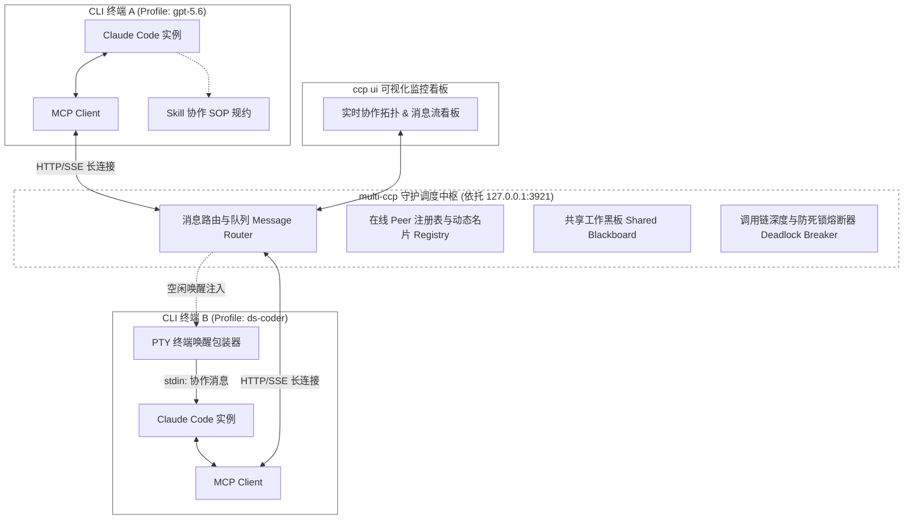
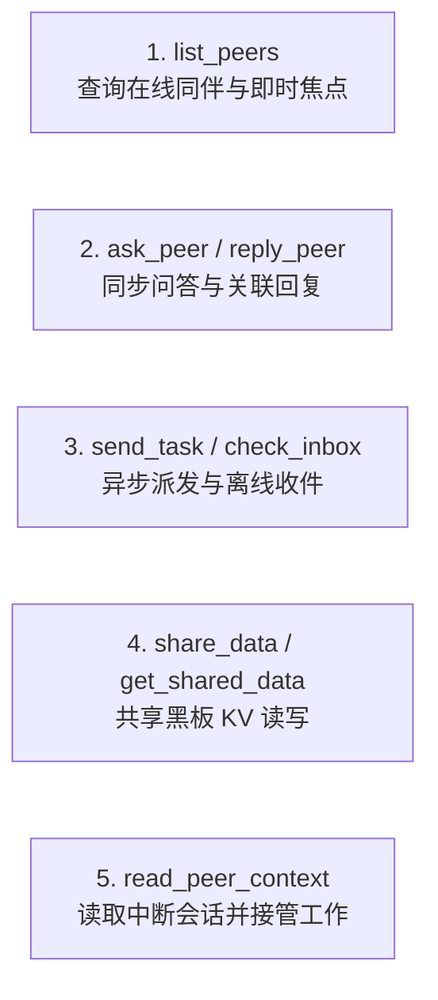
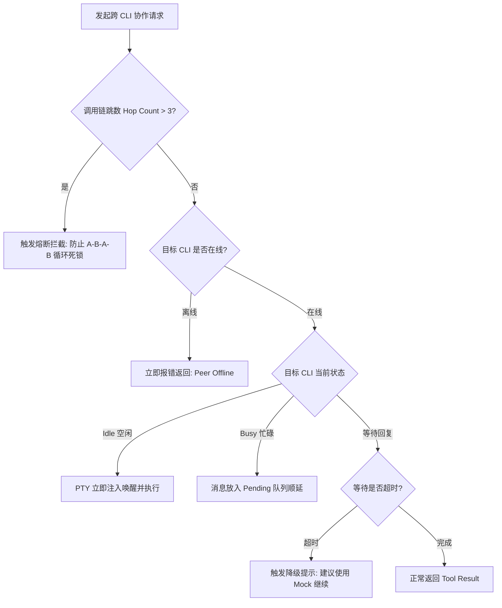

# multi-ccp 多 CLI 实时通讯与智能体协作架构设计 (Agent Mesh Architecture)

## 1. 概述与背景

`multi-ccp` 目前支持通过独立的 Profile 配置目录运行多个 Claude Code 实例，并通过 `sync-session`（[src/core/sessions.ts](file:///D:/CodingDev/multi-ccp/src/core/sessions.ts)）实现会话日志的事后离线同步。

为了支持**多终端 CLI 实例在会话运行过程中的实时交互、相互通信与协同编码**，本方案设计了基于 **「MCP 通信总线 + Skills 行为规约 + 本地守护中枢 + PTY 终端唤醒」** 的多智能体动态对等网络架构（Agent Mesh）。



---

## 2. 核心架构设计理念

### 2.1 动态对等网络 (Dynamic Peer-to-Peer Mesh)，无固定静态角色
* **拒绝固定角色固化**：Profile（如 `work`、`ds-coder`、`gpt-5.6`）仅代表模型配置、API 路由与运行环境，每个 CLI 实例都是 100% 全功能的通用 Coding Agent。
* **会话级任务驱动**：每次打开终端开启的都是全新的动态任务会话。Agent 当前的“职责”由用户的即时 Prompt 和上下文动态决定，而非静态配置文件硬编码。
* **动态自声明名片 (Live Context & Focus)**：CLI 在会话推进中自动向调度中枢更新自身的工作焦点（如“正在分析 `auth.ts`”），供其他 Peer 动态感知。

### 2.2 双轨结合：MCP (底层通道) + Skills (思维规约)

| 层次 | 负责模块 | 核心职责 | 为何这样分工 |
| :--- | :--- | :--- | :--- |
| **底层通道 (Action)** | **MCP Server** | 提供强类型工具调用（`ask_peer`, `send_task` 等） | 避免 Bash 权限确认弹窗打断，JSON Schema 强校验，原生支持异步 Promise 挂起与超时控制。 |
| **思维规约 (Thought)** | **Skills (SKILL.md)** | 提供协作 SOP、提问规范、防冲突意识 | 约束 LLM 避免无效闲聊，强制三段式结构化提问，指导何时主动协作与降级。 |

---

## 3. 作用域与会话生命周期

### 3.1 网络作用域 (Scope)
1. **同项目作用域 (Same-Project Mesh，默认)**：
   - 处于同一工程目录的多个 CLI 自动组网。
   - 认知完全对齐，共享相同的文件系统相对路径。
2. **跨项目作用域 (Cross-Project Mesh，支持微服务/前后端分离)**：
   - 跨目录通信时，消息体要求**自带上下文片段**（代码块/接口文档），避免依赖单一相对路径。

### 3.2 会话生命周期 (Session Lifecycle)
* **融入当前活跃会话**：跨 CLI 消息必须注入到目标 CLI 的**当前正在进行的会话**末尾。
* **复用短时工作记忆 (Working Memory)**：目标 CLI 直接基于已读取的代码上下文作答，无需重新扫描项目，实现毫秒级精准回复。

---

## 4. MCP 工具集规范设计 (Tool Schema)

工具集遵循极简、正交设计，提供 5 类核心协作能力；`check_inbox`、`reply_peer` 与 `update_focus` 用于补全收件、回复和状态更新生命周期：



### 4.1 `list_peers`（查看在线伙伴）
```json
{
  "name": "list_peers",
  "description": "列出当前在线的 CLI 同伴、所用模型、当前工作焦点及最近修改的文件",
  "inputSchema": {
    "type": "object",
    "properties": {
      "all_projects": {
        "type": "boolean",
        "description": "是否包含非当前项目目录的其它在线 CLI，默认 false"
      }
    }
  }
}
```

### 4.2 `ask_peer`（同步阻塞问答）
```json
{
  "name": "ask_peer",
  "description": "仅向有在线终端的 CLI 同伴询问问题，当前会话会挂起等待回复；离线、死机或额度耗尽时改用 read_peer_context",
  "inputSchema": {
    "type": "object",
    "properties": {
      "to": { "type": "string", "description": "目标 Profile 名称，如 'ds-coder'" },
      "context": { "type": "string", "description": "简要背景说明" },
      "question": { "type": "string", "description": "具体诉求或问题" },
      "expected_format": { "type": "string", "description": "期望回复格式，如 'TypeScript Interface 声明'" },
      "timeout_seconds": { "type": "number", "default": 45, "description": "超时时间（秒）" },
      "allow_offline_execution": { "type": "boolean", "default": false, "description": "显式允许无在线终端时启动后台 CLI；故障接管场景禁止启用" }
    },
    "required": ["to", "question"]
  }
}
```

### 4.3 `send_task`（异步非阻塞任务派发）
```json
{
  "name": "send_task",
  "description": "向指定的 CLI 同伴派发异步任务，立即返回 task_id，双方继续并行工作",
  "inputSchema": {
    "type": "object",
    "properties": {
      "to": { "type": "string", "description": "目标 Profile 名称" },
      "task_title": { "type": "string", "description": "任务简述" },
      "task_detail": { "type": "string", "description": "详细要求与上下文" }
    },
    "required": ["to", "task_title", "task_detail"]
  }
}
```

### 4.4 `share_data` / `get_shared_data`（共享工作黑板）
```json
{
  "name": "share_data",
  "description": "在项目全局共享黑板中存储临时的公共数据（接口契约、公共设计等）",
  "inputSchema": {
    "type": "object",
    "properties": {
      "key": { "type": "string", "description": "键名，如 'api-v1-auth-spec'" },
      "value": { "type": "string", "description": "内容" }
    },
    "required": ["key", "value"]
  }
}
```

### 4.5 `read_peer_context`（读取中断会话上下文）
```json
{
  "name": "read_peer_context",
  "description": "当目标 CLI 死机、额度耗尽或无法回复时，读取其当前项目最近会话的有限交接上下文",
  "inputSchema": {
    "type": "object",
    "properties": {
      "to": { "type": "string", "description": "目标 Profile 名称" },
      "session_id": { "type": "string", "description": "可选会话 ID；默认读取当前项目最近会话" },
      "max_messages": { "type": "number", "default": 12, "maximum": 40 },
      "max_chars": { "type": "number", "default": 12000, "maximum": 30000 },
      "include_tool_activity": { "type": "boolean", "default": true }
    },
    "required": ["to"]
  }
}
```

返回内容包含会话标题、最近请求与回答、有限工具活动、活跃文件候选和 Claude Code 的交接摘要。读取器不会返回 thinking / redacted-thinking，常见 Token、API Key 与 Authorization 内容会脱敏，超出限制的内容会明确标记为截断。调用方接管工作前仍须重新读取当前文件状态。

---

## 5. Skills 协作 SOP 规约设计 (`SKILL.md`)

注入到各 Profile 的规约文档，约束 Agent 的协同行为准则：

````markdown
# 跨 CLI 智能体协作 SOP 规约

当你所在的终端与其他 multi-ccp 终端实例协同工作时，请遵循以下规则：

## 1. 提问前自省
- 优先查阅本地文件与共享黑板 (`get_shared_data`)。
- 当确实需要向同伴求助或派发任务时，使用 `list_peers` 检查对方状态。

## 2. 结构化通信格式
发送消息时必须包含：
- **Context (背景)**：你正在做什么，为什么需要对方配合。
- **Task (诉求)**：明确、具体的行动请求。
- **Output Criteria (期望输出)**：期望的代码签名、日志格式或结论。
- 严禁发送“在吗？”等无上下文的寒暄。

## 3. 并行与阻塞模式选择
- **强依赖（卡点）**：目标有在线终端时，使用 `ask_peer` 同步等待答案（带超时控制）。
- **弱依赖（分工）**：目标可工作时，使用 `send_task` 派发子任务后立即继续手头工作。
- **故障接管（恢复）**：目标死机、退出、卡死、额度耗尽或无法回复时，直接使用 `read_peer_context`，禁止要求故障 Agent 自己总结。

## 4. 冲突防范与降级策略
- 如果发现对方正在编辑相同文件，请主动发消息协商，避免覆盖。
- 若 `ask_peer` 返回 `offline`、超时或执行错误，立即使用 `read_peer_context` 读取其最近会话并接管，不可无限期等待或反复询问。
````

---

## 6. 系统防死锁与容错保障机制



1. **调用链追踪与死锁熔断 (Trace Hop Breaker)**：
   - 每条消息附带 `trace_id` 与 `hop_count`。若发现循环调用链跳数 $> 3$，中枢自动拦截熔断。
2. **状态感知与排队机制**：
   - **目标 Idle**：PTY 自动注入 Prompt 敲回车唤醒。
   - **目标 Busy**：暂存队列，待当前轮次结束自动作为下一轮 Prompt 顺延输入。
3. **超时与 Mock 降级**：
   - 同步 `ask_peer` 超时后自动返回降级建议，保障发送方不会卡死。

---

## 7. multi-ccp 代码库集成方案

```text
multi-ccp/
├── src/
│   ├── collab/                      # 协作核心子系统
│   │   ├── hub.ts                   # 消息路由总线、在线注册表、黑板存储
│   │   ├── mcp-protocol.ts          # MCP 工具定义与 JSON-RPC 请求处理
│   │   ├── mcp-stdio.ts             # Claude Code stdio MCP 控制通道
│   │   ├── peer-context.ts          # 中断会话上下文提取、截断与脱敏
│   │   ├── pty-activator.ts         # 跨平台 PTY 包装与空闲唤醒注入器
│   │   └── deadlocks.ts             # 调用链追踪与循环熔断器
│   ├── gateway/
│   │   └── server.ts                # 现有多 Profile Gateway，挂载 /mcp/collab 路由
│   ├── core/
│   │   ├── launcher.ts              # 启动时注入 MCP 配置与协作 SOP
│   │   └── settings.ts              # Profile settings.json 协同字段扩展
│   └── web/
│       └── server.ts                # Web UI 增加「协同拓扑大盘」
```

---

## 8. 实施路线图 (Roadmap)

* **Phase 1 (基础通信层)**：在现有 Gateway 中实现 `hub.ts` 与 `mcp-server.ts`，打通同项目跨 Profile 消息收发与黑板读写。
* **Phase 2 (PTY 自动唤醒层)**：改造 `launcher.ts` 引入 PTY 终端驱动，实现空闲 CLI 的自动唤醒与任务排队。
* **Phase 3 (Web UI 可视化与干预)**：在 `ccp ui` 页面中提供多智能体实时拓扑图、消息流水与人工干预通道。
